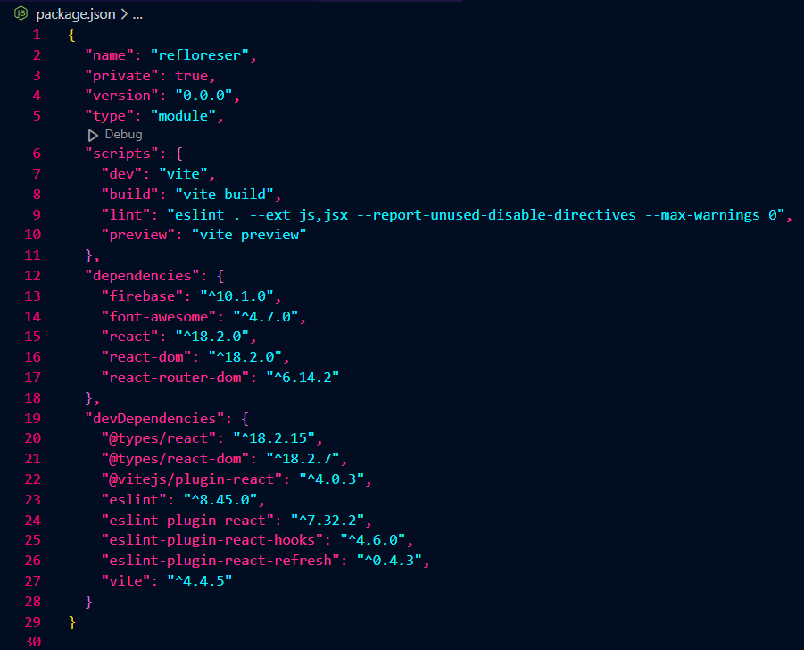

Em desenvolvimento...
# 🧠 Conhecendo o projeto

## 🌳RefloreSer

RefloreSer é um ONG voltada para o reflorestamento e manutenão da fauna, flora e águas brasileiras.

🚀 Vem conferir o resultado final: https://refloreser.vercel.app/

#### O site conterá 3 páginas:

```
Home
Sobre
Contato
```

#### Todas as páginas terão os componentes:

```
Menu
Header
Footer
```

### Estrutura do projeto




<br />

## `💻 Tecnologias usadas`

| Ferramenta | Descrição |
| --- | --- |
| `ReactJS` | framework web|
| `Vite` | gerador de projeto de front-end|
| `npm` | gerenciador de pacotes|
| `Firebase` | Ferramenta Firestore Database para gravar de mensagens|
| `React router dom` | Dependência para criar rotas no reactjs|
| `Vercel` | Hospedagem para a aplicação, fiz o deploy integrado com o github|
| `Github` | Hospedagem do código fonte integrado com gerenciador de versionamento|

<br />

### `📝 Como rodar o projeto localmente`

Siga os passos e inclua as informações abaixo:

| Passo |	Comando/informação |
| --- | --- |
| Faça o fork |	`botão de forkar`|
| Faça o clone |	`git clone`|
|  Instale as dependências após acessar a pasta projeto	| `npm i`|
| Crie as variaveis de ambiente para integrar com Firebase e inclua os valores da sua conta | `conforme .env.example e lista abaixo`|
 Rode o projeto	| `npm run dev`|

 **Variáveis de ambiente**

 * VITE_API_KEY=
 * VITE_AUTH_DOMAIN=
 * VITE_PROJECT_ID=
 * VITE_STORAGE_BUCKET=
 * VITE_MESSAGING_SENDER_ID=
 * VITE_APP_ID=
 * VITE_MEASUREMENT_ID=
 
<br />
<br />

## 💪 Desafios 

- Criação do banco de dados no Firebase.
- Estilização correta da resposividade.
- Achar dados sobre a eficacia/impacto do reflorestamento em zonas desmatadas.

##  Próximos passos mapeados

- Criação de página para cadastro de usuarios.
- Criação de página onde irá conter informações sobre projetos em andamentos e futuros.
- Revisão de acessivilidade.
- Revisão de responsividade.
 ---
 <b>

## `Onde me achar`

-[instagram] (https://www.instagram.com/xlemaxxi_/)
-[github] (https://github.com/ledinemax)
-[linkedin] (https://www.linkedin.com/in/ledinemaximiano/)
